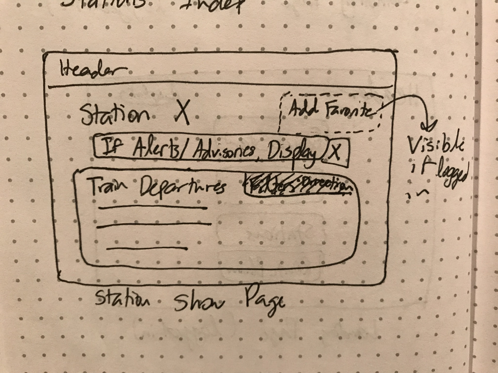

# BART Track

## Project 3

Use the app: [Deployed on Heroku](https://barttrack.herokuapp.com/)

### Summary

BART Track is a full stack application that lists real-time departures and gives trip planning options for the Bay Area Rapid Transit (BART) system.

### Technologies

- Front End: React
- Back End: Express, MongoDB
- Third Party APIs: [BART API](http://api.bart.gov/)

The styling for the front end is done with Bootstrap using the Bootswatch theme Cosmo.

## User Stories

**Elevator Pitch**: Give users real time train information and route planning for Bay Area Rapid Transit (BART) in a straightforward and delightful way.

### Sprint 1: Users & Auth

**A user should be able to:**

- Navigate to "/" and see Home Page with options to 
	- Log In
	- Sign Up
- Sign up for an account
- Log in with an existing account

### Sprint 2: CRUD

**A user should be able to:**

- On Home page, see options to navigate to:
	- Stations
	- Routes
- Click 'Stations' from Home page to view all stations in the BART system
- Click on a station to be directed to its show page
- On a station's page:
	- See live train departures with:
		1. Departure times
		2. Number of cars
		3. Final destination
	- See alerts/advisories impacting this station
- Click 'Routes' from Home Page to navigate to Routes page
- On Routes page, Select a start and end station
- Specify the departure/arrival time
	- Default to departure time is current time
- On a route's page:
	- See live train departures for this route
	- See fare information for this route
	- See alerts/advisories impacting this route
	- Detail any train transfers (if applicable)

**A user should be able to:**

- Add stations/routes to their Favorites
- Remove stations/routes to their Favorites
- See two additional options on the Home Page:
	- Quick Start (if designated)
	- Favorites
- From their Favorites, designate one station or route as the Quick Start option
- Click on 'Quick Start' in order to be taken directly to the designated favorite's home page
- Change their 

### Sprint 3: Style & UI

**A user should be able to:**

- View the BART System Map
- On the station index page:
	- See all stations by default
	- Filter stations by route
	- Filter stations by region
- On a station's show page: 
	- See link to open modal of today's schedule for the station
- Interact with the application from a mobile device
- See train information color coded to emphasize important information (time until departure, fewer number of cars, etc.)
- Add favorites from:
	- User Favorites Page
	- Route Show Page
	- Station Show Page

### Sprint 4: Stretch Goals

**A user should be able to:**

- On a station/route show page:
	- See current weather at the station
	- If a route show page, see current weather at start and end station
- Use location services to suggest the station show page closest to their location
- On a station show page:
	- Filter trains by direction
	- Filter trains by platform
- Add their first favorite from Sign Up form

### Models

#### User
- Email (String, unique)
- Password (String)
- Name (String, optional)
- QuickStart: Favorite.Id 

#### Favorite
- Start Station (String) *for stations and routes*
- End Station (String, optional) *only for routes*
- User: User.Id

## Wireframes

- Landing Page (not logged in)

- Landing Page (logged in)

- Login Page

- Sign Up Page

- Favorites Page

- Stations Index

- Stations Show

- Routes Index

- Routes Show

